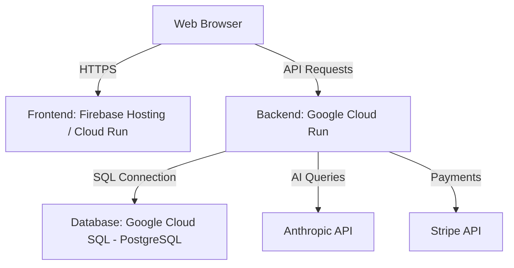

# StaffVerify GCP Deployment Guide

This guide explains how to deploy the **StaffVerify** application to **Google Cloud Platform (GCP)** using modern, serverless, and cost-effective services:
- **Database:** Google Cloud SQL (PostgreSQL)
- **Backend API:** Google Cloud Run (Express.js containerized server)
- **Frontend React App:** Firebase Hosting (Recommended for static/CDN delivery) or Google Cloud Run (using Nginx)

---

## Architecture Overview



---

## Prerequisites

Before starting, ensure you have:
1. A **Google Cloud Platform** account with billing enabled.
2. The [Google Cloud CLI (gcloud)](https://cloud.google.com/sdk/docs/install) installed and initialized:
   ```bash
   gcloud auth login
   gcloud auth application-default login
   ```
3. A GCP project created:
   ```bash
   gcloud config set project YOUR_PROJECT_ID
   ```
4. Enabled the necessary GCP APIs:
   ```bash
   gcloud services enable run.googleapis.com sqladmin.googleapis.com artifactregistry.googleapis.com cloudbuild.googleapis.com
   ```

---

## Step 1: Set Up PostgreSQL on Cloud SQL

1. **Create a PostgreSQL Instance:**
   Create a PostgreSQL instance (version 14 or higher). For development/production staging, you can use a lightweight shared-core instance:
   ```bash
   gcloud sql instances create staffverify-db --database-version=POSTGRES_16 --tier=db-f1-micro --region=us-central1 --root-password=g5kucvUYskaQ
   ```
   *Note: Choose a region close to your users (e.g., `us-central1` or `europe-west1`).*

2. **Create the Database:**
   ```bash
   gcloud sql databases create staffverify --instance=staffverify-db
   ```

3. **Get the Instance Connection Name:**
   Find the connection name (format: `project-id:region:instance-name`):
   ```bash
   gcloud sql instances describe staffverify-db --format="value(connectionName)"
   ```
   *Example output: `staffverify-prod-123456:us-central1:staffverify-db`*

---

## Step 2: Deploy the Backend API to Cloud Run

The backend has been configured with a [Dockerfile](file:///C:/Users/udoda/Documents/Freelance/dan/staffverify/backend/Dockerfile) that automatically handles TypeScript compilation and Prisma database migrations upon startup.

### 1. Create an Artifact Registry Repository
Create a repository to store the backend Docker container:
```bash
gcloud artifacts repositories create staffverify-repo \
  --repository-format=docker \
  --location=us-central1 \
  --description="StaffVerify Docker images"
```

### 2. Build and Push the Container Using Cloud Build
You can build the image directly in the cloud (no local Docker engine required):
```bash
# Execute from the /backend directory
cd backend
gcloud builds submit --tag us-central1-docker.pkg.dev/YOUR_PROJECT_ID/staffverify-repo/backend:latest .
```

### 3. Deploy to Google Cloud Run
Deploy the container to Cloud Run. Make sure to:
- Attach the Cloud SQL instance so Prisma can access the database.
- Define your environment variables.

```bash
gcloud run deploy staffverify-api \
  --image=us-central1-docker.pkg.dev/YOUR_PROJECT_ID/staffverify-repo/backend:latest \
  --platform=managed \
  --region=us-central1 \
  --allow-unauthenticated \
  --add-cloudsql-instances=YOUR_PROJECT_ID:us-central1:staffverify-db \
  --set-env-vars="NODE_ENV=production,PORT=8080,DATABASE_URL=postgresql://postgres:YOUR_DB_ROOT_PASSWORD@/staffverify?host=/cloudsql/YOUR_PROJECT_ID:us-central1:staffverify-db,JWT_SECRET=YOUR_SECURE_JWT_SECRET,JWT_EXPIRES_IN=7d,CORS_ORIGIN=*"
```

> [!IMPORTANT]
> - Note the Unix socket format of the `DATABASE_URL` used by Cloud Run when connected to Cloud SQL: `postgresql://<user>:<password>@/<database>?host=/cloudsql/<instance_connection_name>`.
> - Replace `*` in `CORS_ORIGIN` with your actual frontend domain once deployed to secure your API.

Save the **Service URL** outputted by Cloud Run (e.g., `https://staffverify-api-xxx-uc.a.run.app`). This is your `VITE_API_URL`.

---

## Step 3: Deploy the Frontend React SPA

There are two primary options for deploying the frontend. **Option A** (Firebase Hosting) is recommended because it is serverless, has a generous free tier, is backed by Google's global CDN, and automatically handles SPA routing.

### Option A: Firebase Hosting (Recommended)

1. **Install Firebase Tools:**
   ```bash
   npm install -g firebase-tools
   firebase login
   ```

2. **Initialize Firebase in the Frontend:**
   ```bash
   cd ../frontend
   firebase init hosting
   ```
   - Select **Create a new project** or **Use an existing project** (choose your GCP project).
   - What do you want to use as your public directory? **`dist`**
   - Configure as a single-page app (rewrite all urls to /index.html)? **Yes**
   - Set up automatic builds and deploys with GitHub? **Optional**

3. **Build the Frontend with the Cloud Run API URL:**
   Create a local `.env.production` file or set the environment variable directly:
   ```bash
   # Windows PowerShell
   $env:VITE_API_URL="https://YOUR-CLOUD-RUN-API-URL"
   npm run build

   # Linux/macOS
   VITE_API_URL="https://YOUR-CLOUD-RUN-API-URL" npm run build
   ```

4. **Deploy to Firebase Hosting:**
   ```bash
   firebase deploy --only hosting
   ```
   Firebase will return a hosting URL (e.g., `https://your-project.web.app`).

---

### Option B: Cloud Run Container (Alternative)

If you prefer to keep both frontend and backend as Docker containers on Cloud Run:

1. **Build and Push the Frontend Image:**
   Pass the backend Cloud Run URL as a build argument:
   ```bash
   # Execute from /frontend directory
   gcloud builds submit --tag us-central1-docker.pkg.dev/YOUR_PROJECT_ID/staffverify-repo/frontend:latest \
     --build-arg="VITE_API_URL=https://YOUR-CLOUD-RUN-API-URL" .
   ```

2. **Deploy the Frontend to Cloud Run:**
   ```bash
   gcloud run deploy staffverify-web \
     --image=us-central1-docker.pkg.dev/YOUR_PROJECT_ID/staffverify-repo/frontend:latest \
     --platform=managed \
     --region=us-central1 \
     --allow-unauthenticated
   ```

---

## Step 4: Finalize Configurations

### 1. Update CORS Configuration
After deploying your frontend, copy its URL and update the backend Cloud Run configuration to restrict access:
```bash
gcloud run services update staffverify-api \
  --region=us-central1 \
  --update-env-vars="CORS_ORIGIN=https://your-frontend-domain.com"
```

### 2. Database Seeding in Production (Optional)
To seed initial data into production:
1. Temporarily authorize your local development machine's public IP address in the Cloud SQL instance dashboard, or use the [Cloud SQL Auth Proxy](https://cloud.google.com/sql/docs/postgres/sql-proxy) locally.
2. Update your local backend `.env` file's `DATABASE_URL` to point to the Cloud SQL instance.
3. Run the migrations and seed command from the `backend/` directory:
   ```bash
   npm run prisma:generate
   npx prisma migrate deploy
   npm run prisma:seed
   ```

---

## Secrets Management (Production Best Practice)

Instead of passing secrets directly in the deployment command, store sensitive variables (`DATABASE_URL`, `JWT_SECRET`, `STRIPE_SECRET_KEY`, etc.) in **Google Secret Manager** and mount them into Cloud Run:

1. Create a secret:
   ```bash
   echo -n "your-secret-value" | gcloud secrets create jwt-secret --data-file=-
   ```
2. Grant the Cloud Run service account access to the secret.
3. Reference the secret in Cloud Run:
   ```bash
   gcloud run deploy staffverify-api \
     --image=us-central1-docker.pkg.dev/YOUR_PROJECT_ID/staffverify-repo/backend:latest \
     --update-secrets="JWT_SECRET=jwt-secret:latest"
   ```
